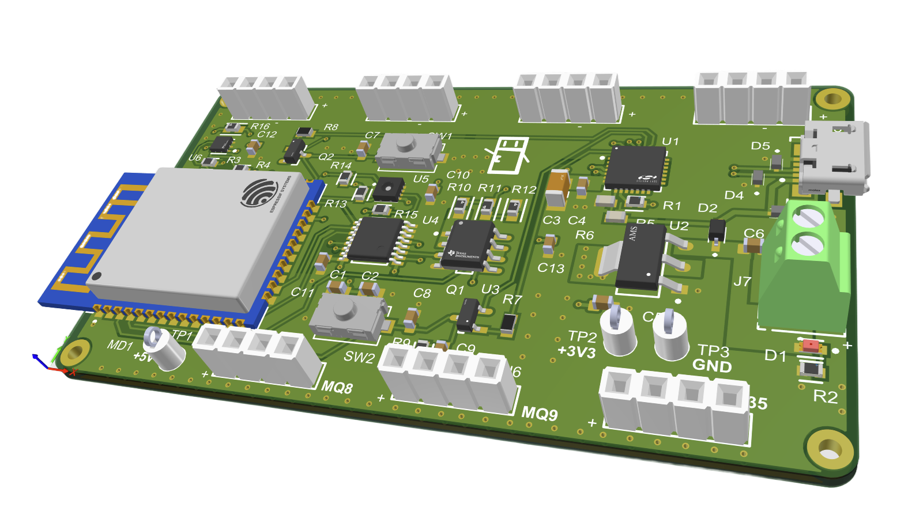

# F.R.E.D. - Fridge Registry & Expiry Detector
 Capstone Project 2026 by Huner Dogra, Sarbjot Ghotra, Charlotte Funnekotter and Isaac Thomas

- 🧊 Food inventory and freshness tracking in one system
	- Directory: [FIRMWARE/prototype_REV2](FIRMWARE/prototype_REV2), [DATABASE/src](DATABASE/src)
	- **ESP32** firmware (**Arduino** + **PlatformIO**) streams fridge sensor data, running on **custom PCB**
	  
	- **Python** backend (**Flask**) stores and serves inventory/sensor state in real-time

- 🌡️ Real-time sensing + spoilage intelligence
	- Directory: [DATABASE/src](DATABASE/src), [REFERENCE/SPOILAGE_ALGO](REFERENCE/SPOILAGE_ALGO)
	- **MQ** gas sensors, **SHT30** temperature/humidity, and **OPT3004** light sensing
	- Spoilage prediction logic combines sensor data to contribute to spoilage prediction

- 📷 Camera-assisted food recognition
	- Directory: [IMAGE_CLASS](IMAGE_CLASS), [DATABASE/src](DATABASE/src)
	- Local image classification using **PyTorch** & **Torchvision**
	- Optional online **Gemini** model for niche food prediction

- 💻 User dashboard for alerts and interaction
	- Directory: [UI](UI)
	- **Vue 3** + **Vite** frontend with charts and inventory views
	- Helps users catch spoilage earlier and reduce food waste
	- Hosted via Amazon AWS, mobile-friendly
